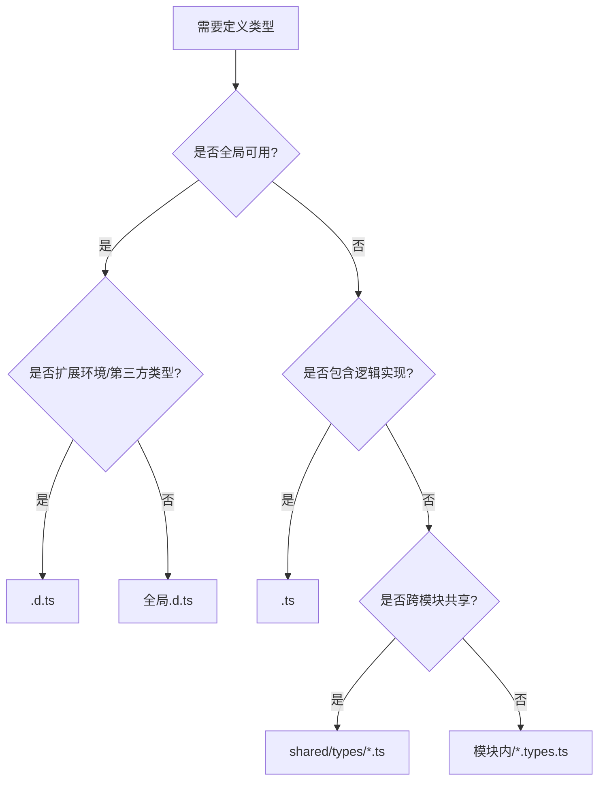

在 TypeScript 项目中，`.d.ts` 文件和 `.ts` 文件（包括 `types.ts`）有明确的区别和使用场景。理解这些差异对大型 Vue3 项目的类型组织至关重要：

### 核心区别对比表

| 特性             | `.d.ts` (声明文件)            | `.ts` / `types.ts` (普通类型文件) |
| ---------------- | ----------------------------- | --------------------------------- |
| **文件性质**     | 纯类型声明文件                | 可包含类型和逻辑的实现文件        |
| **编译输出**     | 不生成 JS 输出                | 生成 JS 输出（除非只有类型）      |
| **导入方式**     | 自动全局/通过三斜线指令       | 显式 import/export                |
| **内容限制**     | 只能包含类型声明              | 可包含类型、变量、函数等          |
| **典型用途**     | 全局声明、模块扩展、环境类型  | 模块私有类型、业务模型类型        |
| **项目位置**     | 通常放在 `src/types` 或根目录 | 可放在任何位置（模块内/shared）   |
| **是否参与构建** | 不参与代码编译                | 参与编译流程                      |

### 具体使用场景分析

#### 1. 使用 `.d.ts` 文件的场景（声明文件）

```typescript
// src/types/menu.d.ts
// 全局菜单类型声明
declare namespace App {
  interface MenuItem {
    name: string;
    path: string;
    icon?: string;
    children?: MenuItem[];
    meta?: {
      requiresAuth?: boolean;
      permission?: string;
    };
  }
}

// 扩展第三方库类型
declare module 'vue-router' {
  interface RouteMeta {
    menuId?: string;
    breadcrumb?: boolean;
  }
}
```

**适用情况**：

1. **全局类型声明**（整个项目可用）
   ```typescript
   // 所有文件直接使用
   const menu: App.MenuItem[] = [...]
   ```
2. **环境类型扩展**
   ```typescript
   // 扩展 window 对象
   declare interface Window {
     __APP_CONFIG__: Record<string, any>;
   }
   ```
3. **第三方库类型补丁**

   ```typescript
   // 修复缺少的类型声明
   declare module 'legacy-js-library' {
     export function missingTypeFunc(): void;
   }
   ```

4. **模块类型扩展**
   ```typescript
   // 扩展 vue-router 的 RouteMeta
   declare module 'vue-router' {
     interface RouteMeta {
       hiddenInMenu?: boolean;
     }
   }
   ```

#### 2. 使用 `types.ts` 的场景（普通类型文件）

```typescript
// src/modules/user/types/user.types.ts
// 模块私有类型
export interface UserProfile {
  id: string;
  name: string;
  avatar: string;
}

// 带逻辑的类型工具
export class UserModel implements UserProfile {
  constructor(public id: string, public name: string, public avatar: string) {}

  get displayName() {
    return this.name || 'Anonymous';
  }
}

// API 响应类型
export type ApiResponse<T> = {
  code: number;
  data: T;
  message?: string;
};
```

**适用情况**：

1. **模块私有类型**

   ```typescript
   // 仅在 user 模块内使用
   import type { UserProfile } from './types/user.types';
   ```

2. **需要导出的业务类型**

   ```typescript
   // 跨文件共享的类型
   export interface Product {
     sku: string;
     price: number;
   }
   ```

3. **类型+逻辑混合**

   ```typescript
   // 包含实现的类
   export class Paginator<T> {
     constructor(public items: T[]) {}

     get count() {
       return this.items.length;
     }
   }
   ```

4. **类型工具函数**
   ```typescript
   // 类型守卫
   export function isAdmin(user: User): user is AdminUser {
     return 'adminPermissions' in user;
   }
   ```

### 决策流程图



### 具体案例解析

#### 案例 1：菜单类型（您的场景）

```typescript
// 正确位置：src/types/layout.d.ts
declare namespace App {
  interface MenuItem {
    name: string;
    path: string;      // 建议用 path 替代 url
    icon?: string;     // 可选属性
    children?: MenuItem[];
    meta?: {
      requiresAuth?: boolean;
      permission?: string;
    };
  }
}

// 使用时不需导入
const mainMenu: App.MenuItem[] = [...];
```

**为什么用 `.d.ts`**：

- 菜单类型在路由守卫、布局组件、用户 Store 等多处使用
- 属于全局基础设施类型
- 不需要关联具体实现逻辑

#### 案例 2：用户资料类型

```typescript
// 正确位置：src/modules/user/types/user.types.ts
export interface UserProfile {
  id: string;
  name: string;
  email: string;
  avatarUrl?: string;
  lastLogin: Date;
}

// 需要显式导入使用
import type { UserProfile } from '@/modules/user/types/user.types';
```

**为什么用 `.types.ts`**：

- 仅在用户模块内使用
- 可能包含关联方法
- 需要精确导入控制

### 最佳实践总结

1. **`.d.ts` 使用原则**：

   - 全局可访问的类型（无需导入）
   - 环境声明（window 扩展）
   - 第三方库类型补丁
   - 项目级基础类型（路由、菜单、权限）
   - 位置：`src/types/*.d.ts`

2. **`types.ts` 使用原则**：

   - 模块私有类型
   - 需要显式导入导出的类型
   - 包含逻辑实现的类型
   - 业务实体类型（User、Product）
   - 位置：`modules/*/types/*.types.ts` 或 `shared/types/*.ts`

3. **避免的陷阱**：

   ```typescript
   // ❌ 错误：在 .d.ts 中导出类型
   declare interface MenuItem {}

   // ✅ 正确：使用 namespace 声明
   declare namespace App {
     interface MenuItem {}
   }
   ```

   ```typescript
   // ❌ 错误：在 .ts 中声明全局类型
   interface GlobalType {} // 污染全局空间

   // ✅ 正确：使用模块导出
   export interface ModuleType {}
   ```

4. **特殊场景处理**：
   **跨模块共享类型**：

   ```typescript
   // shared/types/pagination.ts
   export interface Pagination<T> {
     current: number;
     pageSize: number;
     total: number;
     items: T[];
   }

   // 使用时显式导入
   import type { Pagination } from '@/shared/types/pagination';
   ```

### 项目结构建议

```markdown
src/
├── types/ # .d.ts 声明文件
│ ├── global.d.ts # 全局基础类型
│ ├── router.d.ts # 路由扩展
│ ├── layout.d.ts # 菜单/布局类型 ← 推荐位置
│ └── shims-vue.d.ts # Vue 文件声明
│
├── modules/
│ └── user/
│ ├── types/
│ │ ├── user.types.ts # 用户私有类型
│ │ └── user.api.ts # API 响应类型
│ └── ...
│
└── shared/
└── types/ # 跨模块共享类型
├── pagination.ts
├── utils.ts
└── api.types.ts # 基础 API 响应结构
```

> **黄金法则**：
>
> 1. 影响全局的用 **`.d.ts`**（自动全局）
> 2. 模块私有的用 **`.types.ts`**（显式导入）
> 3. 含逻辑实现的用 **`.ts`**（参与编译）
> 4. 跨模块共享的用 **`shared/types`**（显式导入）

这种组织方式已在多个大型 Vue3 项目中验证，能有效解决类型冲突问题，提高类型系统的可维护性，同时保持编译效率和开发体验。
